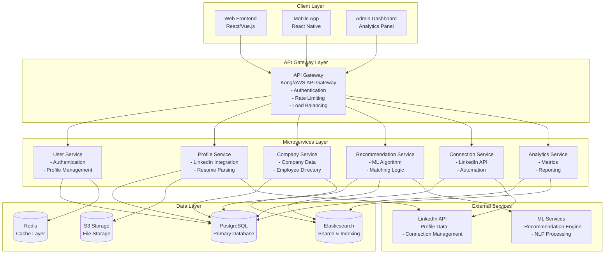
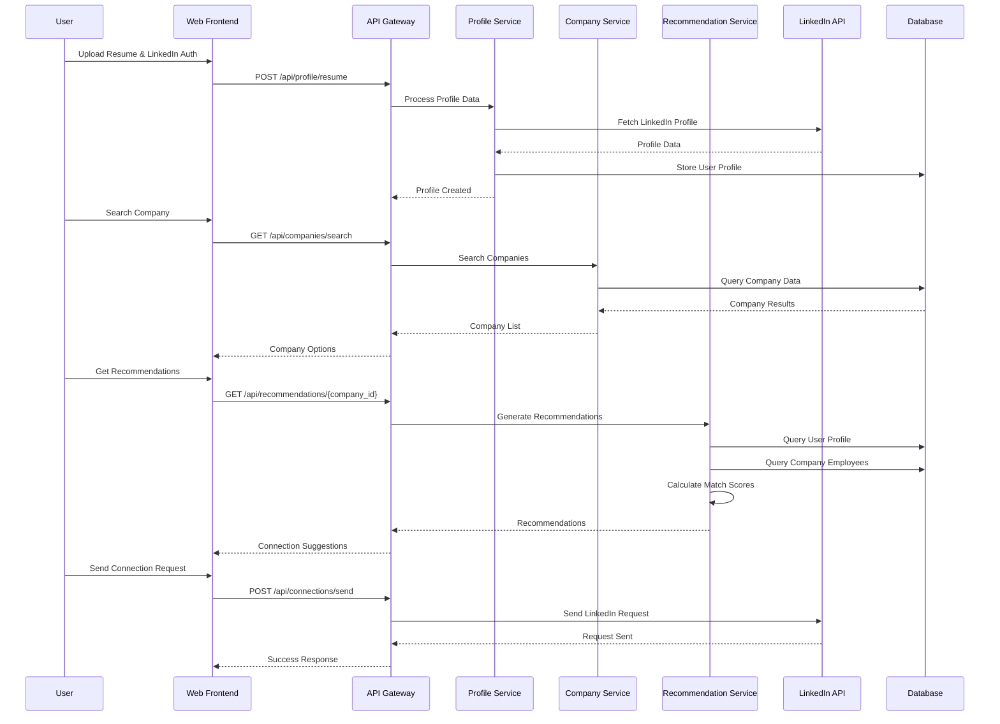

# LinkedIn Networking Application - System Design Document

## 1. Overview

### 1.1 Purpose
This document outlines the system design for a LinkedIn networking application that helps users connect with relevant professionals at target companies by analyzing their LinkedIn profile, resume, and company preferences.

### 1.2 Key Features
- LinkedIn profile integration via LinkedIn API
- Resume parsing and analysis
- Company-based connection recommendations
- Intelligent matching algorithm
- Automated connection management
- Analytics and insights dashboard

## 2. System Architecture

### 2.1 High-Level Architecture



### 2.2 Data Flow Architecture



### 2.2 Core Components

#### 2.2.1 Frontend Applications
- **Web Application**: React/Vue.js SPA for desktop users
- **Mobile Application**: React Native for iOS/Android
- **Admin Dashboard**: Analytics and system management interface

#### 2.2.2 Backend Services
- **API Gateway**: Kong/AWS API Gateway for routing, authentication, rate limiting
- **User Service**: User registration, authentication, profile management
- **Profile Service**: LinkedIn profile processing, resume parsing
- **Company Service**: Company data management, employee directory
- **Recommendation Service**: ML-based connection suggestions
- **Connection Service**: LinkedIn connection automation
- **Analytics Service**: Usage analytics, success metrics

#### 2.2.3 Data Storage
- **PostgreSQL**: Primary database for structured data
- **Redis**: Caching layer for session management and API responses
- **Elasticsearch**: Search and recommendation indexing
- **S3**: File storage for resumes and documents

## 3. Data Models

### 3.1 User Entity
```json
{
  "id": "uuid",
  "email": "string",
  "linkedin_id": "string",
  "linkedin_access_token": "encrypted_string",
  "profile_data": {
    "name": "string",
    "headline": "string",
    "industry": "string",
    "location": "string",
    "experience": "array",
    "education": "array",
    "skills": "array"
  },
  "resume_data": {
    "file_url": "string",
    "parsed_content": "object",
    "skills": "array",
    "experience": "array"
  },
  "preferences": {
    "target_companies": "array",
    "connection_goals": "string",
    "industry_focus": "array"
  },
  "created_at": "timestamp",
  "updated_at": "timestamp"
}
```

### 3.2 Company Entity
```json
{
  "id": "uuid",
  "name": "string",
  "industry": "string",
  "size": "string",
  "location": "string",
  "linkedin_company_id": "string",
  "employees": [
    {
      "linkedin_id": "string",
      "name": "string",
      "position": "string",
      "department": "string",
      "seniority_level": "string",
      "connection_score": "float"
    }
  ],
  "created_at": "timestamp",
  "updated_at": "timestamp"
}
```

### 3.3 Recommendation Entity
```json
{
  "id": "uuid",
  "user_id": "uuid",
  "target_person_id": "string",
  "company_id": "uuid",
  "match_score": "float",
  "reasoning": "array",
  "connection_status": "string",
  "created_at": "timestamp"
}
```

## 4. API Specifications

### 4.1 Authentication Endpoints
```
POST /api/auth/linkedin
POST /api/auth/refresh
POST /api/auth/logout
```

### 4.2 Profile Management
```
GET /api/profile
PUT /api/profile
POST /api/profile/resume
GET /api/profile/companies
```

### 4.3 Recommendations
```
GET /api/recommendations/{company_id}
POST /api/recommendations/refresh
GET /api/recommendations/analytics
```

### 4.4 Connections
```
POST /api/connections/send
GET /api/connections/status
POST /api/connections/accept
```

## 5. Recommendation Algorithm

### 5.1 Matching Criteria
1. **Industry Alignment**: Match user's industry with target company's industry
2. **Skill Compatibility**: Analyze skills overlap between user and target person
3. **Experience Level**: Match seniority levels appropriately
4. **Geographic Proximity**: Consider location-based networking
5. **Mutual Connections**: Leverage existing network connections
6. **Company Culture Fit**: Analyze company values and culture alignment

### 5.2 Algorithm Components
- **Content-Based Filtering**: Profile and resume analysis
- **Collaborative Filtering**: Similar user behavior patterns
- **Graph-Based Analysis**: LinkedIn network analysis
- **Machine Learning Models**: Neural networks for pattern recognition

### 5.3 Scoring System
```
Total Score = (Industry Match × 0.3) + 
              (Skill Overlap × 0.25) + 
              (Experience Alignment × 0.2) + 
              (Geographic Proximity × 0.1) + 
              (Mutual Connections × 0.15)
```

## 6. Security Considerations

### 6.1 Data Protection
- End-to-end encryption for sensitive data
- OAuth 2.0 for LinkedIn API authentication
- JWT tokens for session management
- GDPR compliance for EU users
- Data anonymization for analytics

### 6.2 API Security
- Rate limiting per user/IP
- Input validation and sanitization
- CORS configuration
- API key rotation
- Audit logging

### 6.3 LinkedIn API Compliance
- Respect LinkedIn's API terms of service
- Implement proper rate limiting
- Handle API errors gracefully
- Maintain user consent for data usage

## 7. Scalability Considerations

### 7.1 Horizontal Scaling
- Microservices architecture for independent scaling
- Load balancers for traffic distribution
- Auto-scaling groups for dynamic resource allocation
- Database sharding for large datasets

### 7.2 Caching Strategy
- Redis for session and API response caching
- CDN for static content delivery
- Database query optimization
- Recommendation result caching

### 7.3 Performance Optimization
- Asynchronous processing for heavy operations
- Background job queues for LinkedIn API calls
- Database indexing for fast queries
- Connection pooling for database efficiency

## 8. Deployment Architecture

### 8.1 Infrastructure
- **Cloud Provider**: AWS/Azure/GCP
- **Container Orchestration**: Kubernetes
- **CI/CD**: GitHub Actions/GitLab CI
- **Monitoring**: Prometheus + Grafana
- **Logging**: ELK Stack (Elasticsearch, Logstash, Kibana)

### 8.2 Environment Strategy
- **Development**: Local development with Docker
- **Staging**: Production-like environment for testing
- **Production**: High-availability, multi-region deployment

## 9. Monitoring and Analytics

### 9.1 Key Metrics
- User engagement and retention
- Recommendation accuracy
- Connection success rates
- API performance and availability
- LinkedIn API usage and limits

### 9.2 Alerting
- System health monitoring
- Performance degradation alerts
- Security incident detection
- LinkedIn API rate limit warnings

## 10. Future Enhancements

### 10.1 Advanced Features
- AI-powered conversation starters
- Automated follow-up sequences
- Advanced analytics dashboard
- Integration with other professional networks
- Mobile app push notifications

### 10.2 Advanced Analytics
- User behavior analysis
- Network growth tracking
- Industry trend insights
- Personalized recommendations improvement

## 11. Risk Assessment

### 11.1 Technical Risks
- LinkedIn API changes or restrictions
- Scalability challenges with large user base
- Data privacy and compliance issues
- Third-party service dependencies

### 11.2 Mitigation Strategies
- Regular API monitoring and updates
- Load testing and performance optimization
- Legal compliance review
- Service redundancy and fallback options

---

*This document serves as a comprehensive guide for building the LinkedIn networking application. Regular updates and reviews are recommended as the system evolves.*
